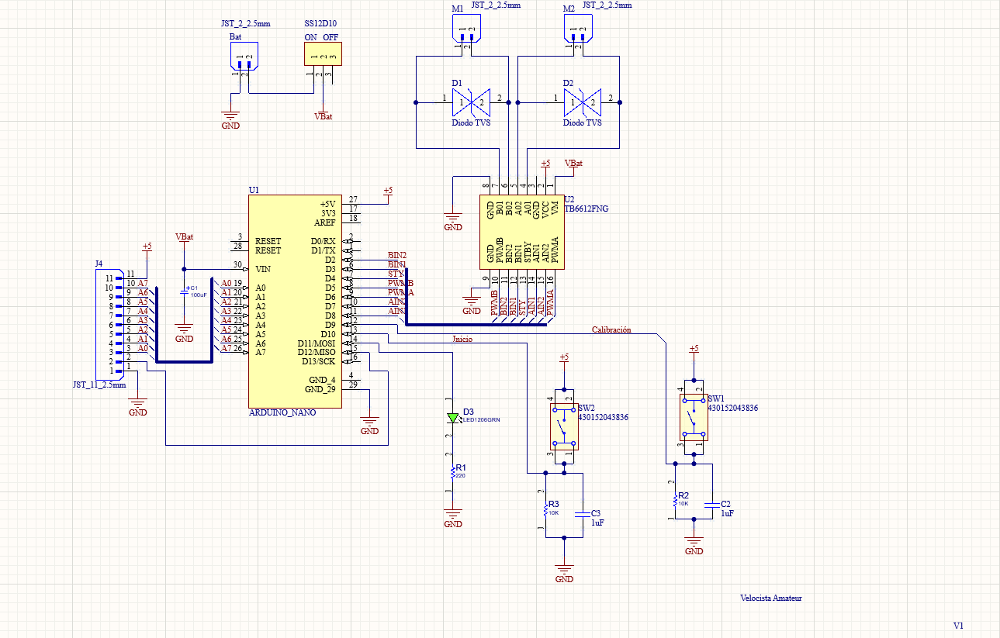
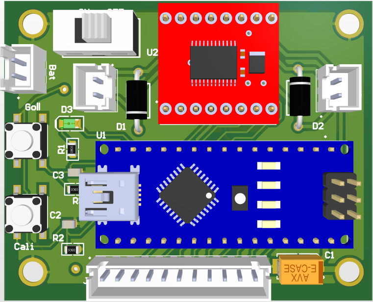
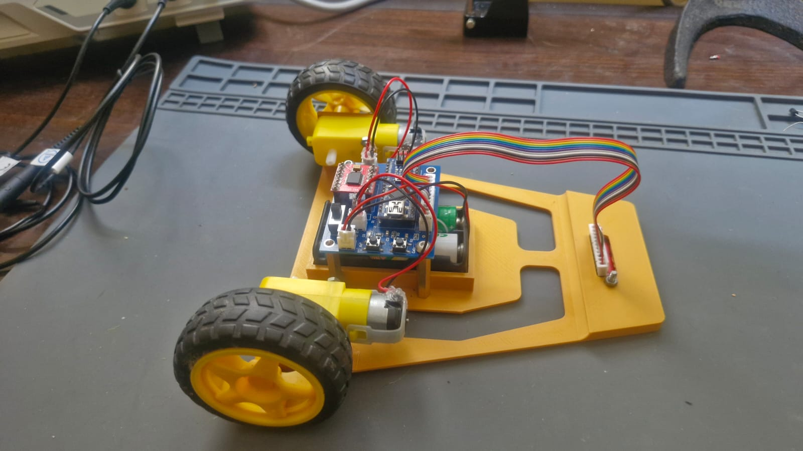

# 🏎️ Robot Velocista Amateur (Arduino Nano)

Robot velocista básico programado en C con PlatformIO. Este proyecto incluye el código de control PID y el diseño de la placa electrónica (PCB) para competencias de nivel amateur.

## 📸 Galería del Proyecto

### 1. Circuito
El circuito fue diseñado a medida para reducir peso, cableado y espacio:

### 2. Diseño del PCB

### 3. El Robot Terminado
Así luce el montaje final del velocista:

## ⚙️ Características Técnicas
* **Microcontrolador:** Arduino Nano
* **Sensores:** Array de sensores infrarrojos
* **Lenguaje:** C++ (PlatformIO)